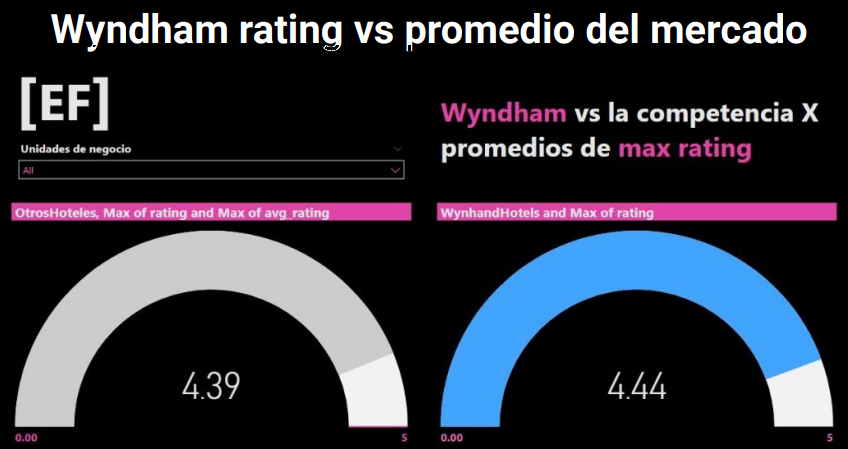
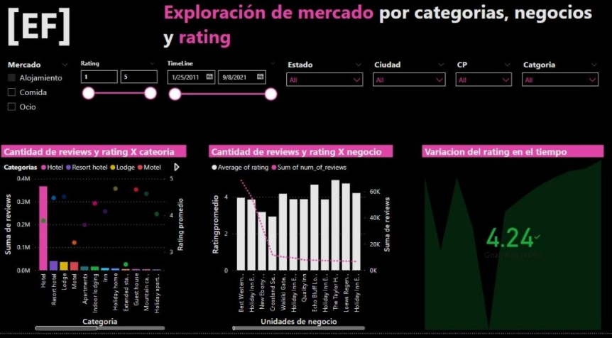
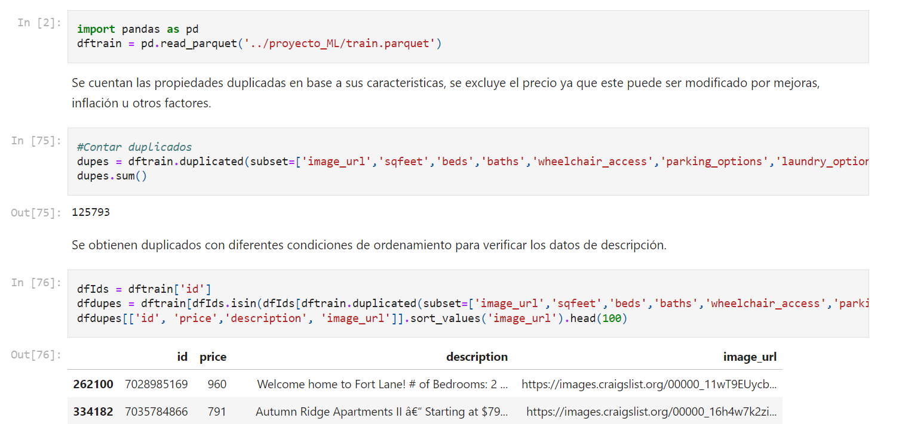
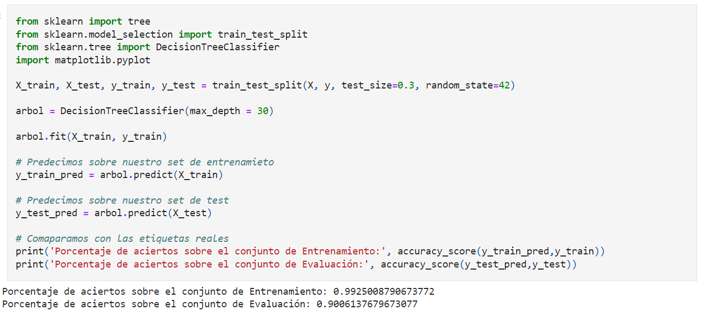
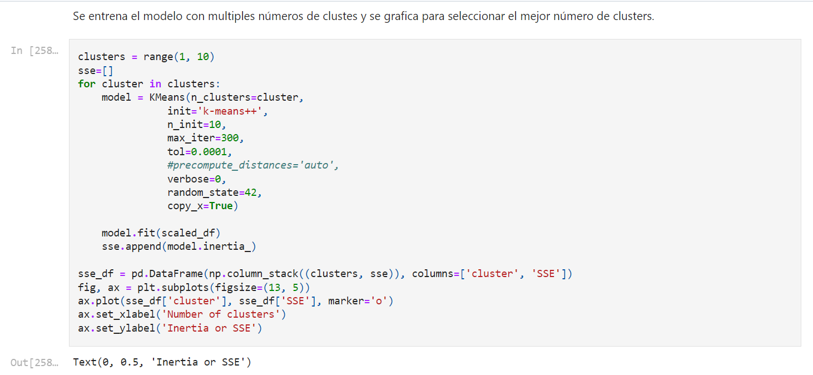

## Portfolio
[{:style="width: 30px; height: 30px; position: absolute; top: 10px; right: 10px;"}](/en)
[{:style="width: 30px; height: 30px; position: absolute; top: 10px; right: 50px;"}](/)

---

### Soy Henry Bootcamp: Data Science

[Analysis, app and presentation about restaurants and related businesses](https://github.com/naguieta/HenryPF-Google_maps){:target="_blank"}

Market analysis project in the U.S. for a client in the restaurant and tourism sector. Involved analyzing user reviews on Google Maps for hotels and restaurants using machine learning techniques. Tasks included data extraction, cleaning, and availability, along with significant analysis. Integrated data on location, category, ratings, and reviews. Additional sources like stock quotes and social media trends were utilized. The project concluded with recommendations for improving marketing strategies and the development of a recommendation app for specific locations based on user experiences.

  

    

      
      

        
Recommendation app for restaurants and services based on user experiences.

      

    

    

      
      

        
One of the pages generated for the fictional company that hired us.

      

    

    

      
      

        
Comparison of our client's rating against others, included in the business plan.

      

    

    

      
      

        
Technological stack used in this project.

      

    

    

      
      

        
Jupyter Notebook used for the initial analysis.

      

    

    

      
      

        
Code for the recommendation app in Python.

      

    

    

      
      

        
Entity-relationship diagram used in this project.

      

    

    

      
      

        
Exploration of the market by categories, businesses, and ratings.

      

    

    <!-- Add more .carousel-item elements as needed -->
  

  <button class="carousel-control-prev" type="button" data-target="#carouselExampleDark" data-slide="prev">
    <
  </button>
  <button class="carousel-control-next" type="button" data-target="#carouselExampleDark" data-slide="next">
    >
  </button>

---
[Analysis and presentation on MOOCs](https://github.com/naguieta/HenryPI3-MOOCs/tree/main){:target="_blank"}

Conducted exploratory data analysis (EDA) focused on MOOC platforms such as EDX, Udemy, and Coursera. Presented findings through a Power BI dashboard, highlighting conclusions and including a word cloud of offered courses.

  

    

      
      

        
Power BI chart representing enrollees by level and a KPI, with filters for course prices.

      

    

    

      
      

        
Word cloud built from course titles.

      

    

    

      
      

        
Power BI chart representing enrollees by course duration, with filters for price and enrollee count.

      

    

    

      
      

        
Jupyter Notebook with a chart of the number of courses by level.

      

    

  

  <button class="carousel-control-prev" type="button" data-target="#carouselExampleDark2" data-slide="prev">
    <
  </button>
  <button class="carousel-control-next" type="button" data-target="#carouselExampleDark2" data-slide="next">
    >
  </button>

---
[US Property Price Analysis](https://github.com/naguieta/HenryPI2-Datathon){:target="_blank"}

Implemented supervised and unsupervised learning models using machine learning techniques to classify and group properties for sale based on their characteristics. The process included exploratory data analysis, application of cleaning techniques to improve data quality, and implementation of a decision tree for the supervised model and the K-Means algorithm for the unsupervised model.

  

    

      
      

        
Jupiter Notebook that includes the EDA of the obtained data.

      

    

    

      
      

        
Jupiter Notebook showing the application of Sklearn tree.

      

    

    

      
      

        
Jupiter Notebook showing the training with Kmeans.

      

    

  

  <button class="carousel-control-prev" type="button" data-target="#carouselExampleDark3" data-slide="prev">
    <
  </button>
  <button class="carousel-control-next" type="button" data-target="#carouselExampleDark3" data-slide="next">
    >
  </button>

---
[Data Transformation, API Development, and Execution](https://github.com/naguieta/HenryPI1-ETL_API){:target="_blank"}

I transformed CSV data, created an ID field, handled null values, and developed an API with FastAPI. The API provides queries about keywords in titles, movies with specific ratings, the second-highest rated movie, the longest movie, and the number of series and movies by classification. Deployed on Deta.

  

    

      
      

        
FastApi deployed with Deta.

      

    

    

      
      

        
main.py with the code that includes FastApi, Deta, and the necessary logic for its implementation.

      

    

  

  <button class="carousel-control-prev" type="button" data-target="#carouselExampleDark4" data-slide="prev">
    <
  </button>
  <button class="carousel-control-next" type="button" data-target="#carouselExampleDark4" data-slide="next">
    >
  </button>

---
