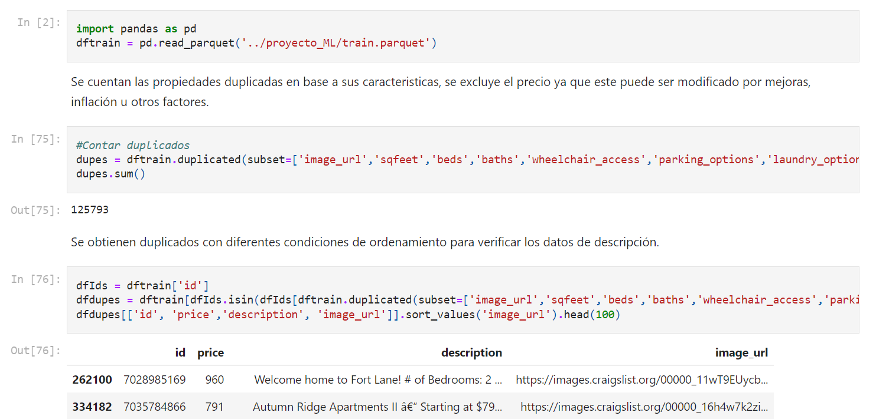
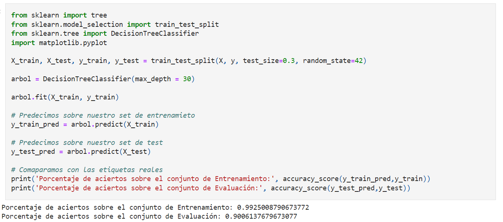
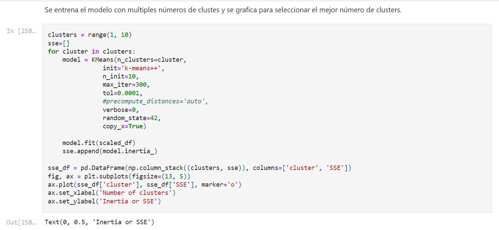
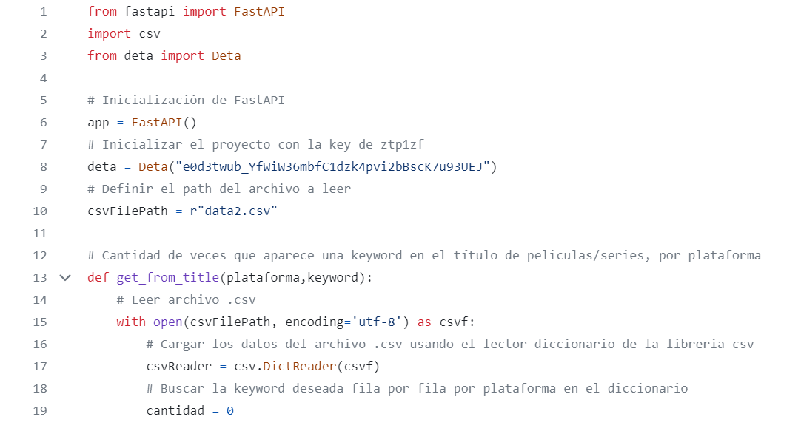

## Portfolio
[{:style="width: 30px; height: 30px; position: absolute; top: 10px; right: 10px;"}](/en)
[{:style="width: 30px; height: 30px; position: absolute; top: 10px; right: 50px;"}](/)

---

[Pipeline de Machine Learning usando Apache Spark - Databricks community](https://databricks-prod-cloudfront.cloud.databricks.com/public/4027ec902e239c93eaaa8714f173bcfc/2977217117936163/3150954278375723/1108562042714916/latest.html){:target="_blank"}

Proyecto sobre el analisis de los clientes de una empresa de comunicaciones que abandonan el prodducto. Se utilizó Databricks Comunnity para crear un pipeline de machine learning utilizando Apache Spark. En este proyecto se puede observar un breve analisis de los datos, la utilizacion de multiples Transformers como OneHotEncoder, StringIndexer, VectorAssembler, entre otros y luego la creacion de varios modelos como Logistic Regression, Random Forest Classifier, y el uso de Cross Validator.

  <ol class="carousel-indicators">
    <li  data-target="#carouselExampleDark5" data-slide-to="0" class="active" aria-current="true" aria-label="Slide 1"></li>
    <li  data-target="#carouselExampleDark5" data-slide-to="1" aria-label="Slide 2"></li>
  </ol>
  

    

      
      

        
Databricks & Apache Spark

      

    

    

      
      

        
Gráfico con Matplotlib.

      

    

    

      
      

        
Diagrama del Pipeline de Machine Learning en Spark.

      

    

    

      
      

        
Aplicación de un Transformer y creación del Pipeline.

      

    

  

  <button class="carousel-control-prev" type="button" data-target="#carouselExampleDark5" data-slide="prev">
    <
  </button>
  <button class="carousel-control-next" type="button" data-target="#carouselExampleDark5" data-slide="next">
    >
  </button>

---

[Análisis, app y presentación sobre restaurantes y negocios afines](https://github.com/naguieta/HenryPF-Google_maps){:target="_blank"}

Proyecto de Análisis de Mercado en EE. UU. para un cliente del sector de restaurantes y turismo. Implicó analizar opiniones de usuarios en Google Maps para hoteles y restaurantes, utilizando técnicas de aprendizaje automático. Se realizaron tareas de extracción, limpieza y disponibilidad de datos, así como un análisis significativo. Se integraron datos de ubicación, categoría, puntuaciones y revisiones. Además, se utilizaron fuentes adicionales como cotizaciones de acciones y tendencias en redes sociales. El proyecto culminó con la formulación de recomendaciones para mejorar estrategias de marketing y el desarrollo de una app de recomendación para lugares específicos según usuario.

  <ol class="carousel-indicators">
    <li  data-target="#carouselExampleDark" data-slide-to="0" class="active" aria-current="true" aria-label="Slide 1"></li>
    <li  data-target="#carouselExampleDark" data-slide-to="1" aria-label="Slide 2"></li>
    <li  data-target="#carouselExampleDark" data-slide-to="2" aria-label="Slide 3"></li>
    <li  data-target="#carouselExampleDark" data-slide-to="3" aria-label="Slide 4"></li>
    <li  data-target="#carouselExampleDark" data-slide-to="4" aria-label="Slide 5"></li>
    <li  data-target="#carouselExampleDark" data-slide-to="5" aria-label="Slide 6"></li>
    <li  data-target="#carouselExampleDark" data-slide-to="6" aria-label="Slide 7"></li>
    <li  data-target="#carouselExampleDark" data-slide-to="7" aria-label="Slide 8"></li>
  </ol>
  

    

      
      

        
App de recomendación de restaurantes y servicios para los usuarios basado en sus experiencias previas.

      

    

    

      
      

        
Una de las páginas generadas para la empresa ficticia que nos contrata.

      

    

    

      
      

        
Comparación del rating de nuestro cliente contra otros, incluido en el bussines plan.

      

    

    

      
      

        
Stack tecnológico utilizado en este proyecto.

      

    

    

      
      

        
Jupyter Notebook utilizado para el primer análisis.

      

    

    

      
      

        
Código de la App de recomendaciones en Python.

      

    

    

      
      

        
Nuestro diagrama de entidad relación utilizado en este proyecto.

      

    

    

      
      

        
Exploración del mercado por categorias, negocios y rating.

      

    

    <!-- Agrega más elementos .carousel-item según sea necesario -->
  

  <button class="carousel-control-prev" type="button" data-target="#carouselExampleDark" data-slide="prev">
    <
  </button>
  <button class="carousel-control-next" type="button" data-target="#carouselExampleDark" data-slide="next">
    >
  </button>

---
[Análisis y presentación sobre MOOCs](https://github.com/naguieta/HenryPI3-MOOCs/tree/main){:target="_blank"}

Realicé un análisis exploratorio de datos (EDA) centrado en plataformas MOOC como EDX, Udemy y Coursera. Presenté los hallazgos a través de un dashboard en Power BI, destacando las concluciones obtenidas y se incluyó un wordcloud sobre los cursos ofrecidos.

 <ol class="carousel-indicators">
    <li  data-target="#carouselExampleDark2" data-slide-to="0" class="active" aria-current="true" aria-label="Slide 1"></li>
    <li  data-target="#carouselExampleDark2" data-slide-to="1" aria-label="Slide 2"></li>
    <li  data-target="#carouselExampleDark2" data-slide-to="2" aria-label="Slide 3"></li>
    <li  data-target="#carouselExampleDark2" data-slide-to="3" aria-label="Slide 4"></li>
  </ol>
  

    

      
      

        
Gráfico en Power BI representando los inscriptos por nivel y un KPI, con filtros por precios de cursos.

      

    

    

      
      

        
Wordcloud construido a partir de los títulos de los cursos ofrecidos.

      

    

    

      
      

        
Gráfico en Power BI representando los inscriptos por duración de cursos, con filtros de precio y cantidad de inscriptos.

      

    

    

      
      

        
Jupyter Notebook con un gráfico de cantidad de cursos por nivel.

      

    

  

  <button class="carousel-control-prev" type="button" data-target="#carouselExampleDark2" data-slide="prev">
    <
  </button>
  <button class="carousel-control-next" type="button" data-target="#carouselExampleDark2" data-slide="next">
    >
  </button>

---
[Análisis de precios de propiedades de Estados Unidos](https://github.com/naguieta/HenryPI2-Datathon){:target="_blank"}

Implementé modelos de aprendizaje supervisado y no supervisado utilizando técnicas de machine learning para clasificar y agrupar propiedades en venta según sus características. El proceso incluyó un análisis exploratorio de datos, la aplicación de técnicas de limpieza para mejorar la calidad de los datos, y la implementación de un árbol de decisión para el modelo supervisado y el algoritmo K-Means para el no supervisado.

  <ol class="carousel-indicators">
    <li  data-target="#carouselExampleDark3" data-slide-to="0" class="active" aria-current="true" aria-label="Slide 1"></li>
    <li  data-target="#carouselExampleDark3" data-slide-to="1" aria-label="Slide 2"></li>
    <li  data-target="#carouselExampleDark3" data-slide-to="2" aria-label="Slide 3"></li>
  </ol>
  

    

      
      

        
Jupiter Notebook que incluye el EDA de los datos obtenidos.

      

    

    

      
      

        
Jupiter Notebook que muestra la aplicación de Sklearn tree.

      

    

    

      
      

        
Jupiter Notebook que muestra el entrenmiento con Kmeans.

      

    

  

  <button class="carousel-control-prev" type="button" data-target="#carouselExampleDark3" data-slide="prev">
    <
  </button>
  <button class="carousel-control-next" type="button" data-target="#carouselExampleDark3" data-slide="next">
    >
  </button>

---
[Transformación de datos, elaboración y ejecución de una API](https://github.com/naguieta/HenryPI1-ETL_API){:target="_blank"}

Transformé datos CSV, creé un campo ID, manejé valores nulos, y desarrollé una API con FastAPI. La API proporciona consultas sobre palabras clave en títulos, películas con calificación específica, segunda película con mayor puntaje, película más larga y cantidad de series y películas por clasificación. Desplegado en Deta.

  <ol class="carousel-indicators">
    <li  data-target="#carouselExampleDark4" data-slide-to="0" class="active" aria-current="true" aria-label="Slide 1"></li>
    <li  data-target="#carouselExampleDark4" data-slide-to="1" aria-label="Slide 2"></li>
  </ol>
  

    

      
      

        
FastApi desplegado con Deta.

      

    

    

      
      

        
main.py con el código que incluye FastApi, Deta y la lógica necesaria para su implementación.

      

    

  

  <button class="carousel-control-prev" type="button" data-target="#carouselExampleDark4" data-slide="prev">
    <
  </button>
  <button class="carousel-control-next" type="button" data-target="#carouselExampleDark4" data-slide="next">
    >
  </button>

---

