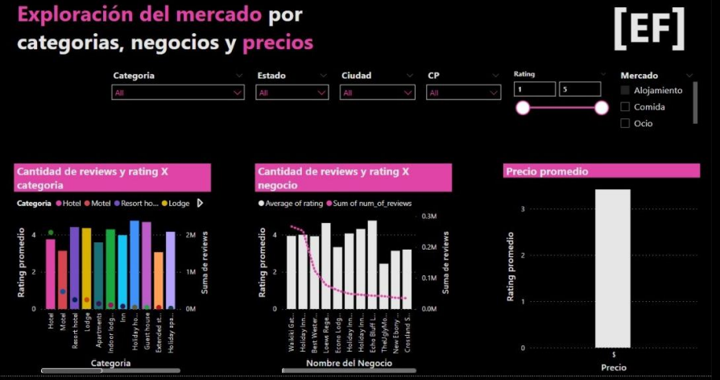
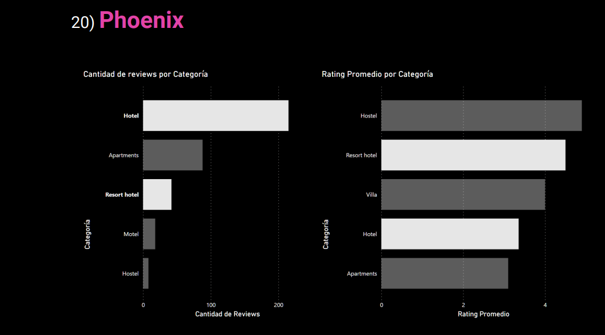

## Portfolio
[{:style="width: 30px; height: 30px; position: absolute; top: 10px; right: 10px;"}](/en)
[{:style="width: 30px; height: 30px; position: absolute; top: 10px; right: 50px;"}](/)

---

### Soy Henry Bootcamp: Data Science

[Análisis, app y presentación sobre restaurantes y negocios relacionados](https://github.com/naguieta/HenryPF-Google_maps){:target="_blank"}

  

    

      
      

        <h5 style="text-align: center; margin: 0; background-color: rgba(0, 0, 0, 0.5);">First slide label</h5>
        
Some representative placeholder content for the first slide.

      

    

    

      
      

        <h5 style="text-align: center; margin: 0; background-color: rgba(0, 0, 0, 0.5);">First slide label</h5>
        
Some representative placeholder content for the first slide.

      

    

    

      
      

        <h5 style="margin: 0; background-color: rgba(0, 0, 0, 0.5);">First slide label</h5>
        
Some representative placeholder content for the first slide.

      

    

    

      
      

        <h5 style="margin: 0; background-color: rgba(0, 0, 0, 0.5);">First slide label</h5>
        
Some representative placeholder content for the first slide.

      

    

    

      
    

    

      
    

    

      
    

    

      
    

    

      
    

    <!-- Agrega más elementos .carousel-item según sea necesario -->
  

  <button class="carousel-control-prev" type="button" data-target="#carouselExampleDark" data-slide="prev">
    <
  </button>
  <button class="carousel-control-next" type="button" data-target="#carouselExampleDark" data-slide="next">
    >
  </button>

---
[Análisis y presentación sobre MOOCs](https://github.com/naguieta/HenryPI3-MOOCs/tree/main){:target="_blank"}

[{:width="45%" max-width="50%"}](https://github.com/naguieta/HenryPI3-MOOCs/blob/main/Power%20Bi/Presentation.pbix){:target="_blank"} [{:width="45%" max-width="50%"}](https://github.com/naguieta/HenryPI3-MOOCs/blob/main/Power%20Bi/WordCloud.pbix){:target="_blank"}
[{:width="45%" max-width="50%"}](https://github.com/naguieta/HenryPI3-MOOCs/blob/main/Power%20Bi/Presentation.pbix){:target="_blank"} [{:width="45%" max-width="50%"}](https://github.com/naguieta/HenryPI3-MOOCs/blob/main/EDA/EDA%20EDX.ipynb){:target="_blank"}

---
[Análisis de precios de propiedades de Estados Unidos](https://github.com/naguieta/HenryPI2-Datathon){:target="_blank"}

[{:width="90%" max-width="100%"}](https://github.com/naguieta/HenryPI2-Datathon){:target="_blank"}

---
[Transformación de datos, elaboración y ejecución de una API](https://github.com/naguieta/HenryPI1-ETL_API){:target="_blank"}
 
[{:width="90%" max-width="100%"}](https://github.com/naguieta/HenryPI1-ETL_API){:target="_blank"}

---

### Category Name 2

- [Project 1 Title](http://example.com/)
- [Project 2 Title](http://example.com/)
- [Project 3 Title](http://example.com/)
- [Project 4 Title](http://example.com/)
- [Project 5 Title](http://example.com/)

---

---
