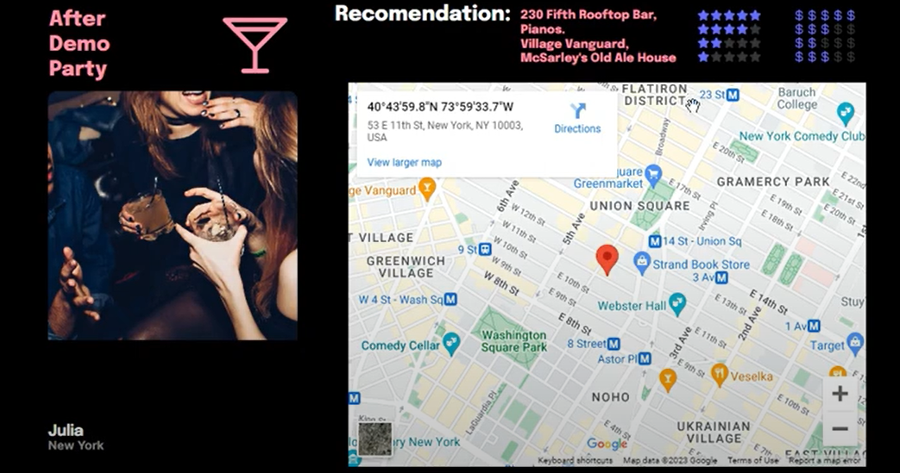

## Portfolio
[{:style="width: 30px; height: 30px; position: absolute; top: 10px; right: 10px;"}](/en)
[{:style="width: 30px; height: 30px; position: absolute; top: 10px; right: 50px;"}](/)

---

### Soy Henry Bootcamp: Data Science

[Análisis, app y presentación sobre restaurantes y negocios afines](https://github.com/naguieta/HenryPF-Google_maps){:target="_blank"}

Esto sería la descripcion del proyecto y no se cuan largo va a ser, asi que copy paste, asi que copy paste, asi que copy paste, asi que copy paste, asi que copy paste, asi que copy paste, asi que copy paste, asi que copy paste, asi que copy paste, asi que copy paste, asi que copy paste, asi que copy paste, asi que copy paste, asi que copy paste

  

    

      
      

        
App de recomendación de restaurantes y servicios para los usuarios basado en sus experiencias previas.

      

    

    

      
      

        
Una de las páginas generadas para la empresa ficticia que nos contrata.

      

    

    

      
      

        
Comparación del rating de nuestro cliente contra otros, incluido en el bussines plan.

      

    

    

      
      

        
Stack tecnológico utilizado en este proyecto.

      

    

    

      
      

        
Jupyter Notebook utilizado para el primer análisis.

      

    

    

      
      

        
Código de la App de recomendaciones en Python.

      

    

    

      
      

        
Nuestro diagrama de entidad relación utilizado en este proyecto.

      

    

    

      
      

        
Exploración del mercado por categorias, negocios y rating.

      

    

    <!-- Agrega más elementos .carousel-item según sea necesario -->
  

  <button class="carousel-control-prev" type="button" data-target="#carouselExampleDark" data-slide="prev">
    <
  </button>
  <button class="carousel-control-next" type="button" data-target="#carouselExampleDark" data-slide="next">
    >
  </button>

---
[Análisis y presentación sobre MOOCs](https://github.com/naguieta/HenryPI3-MOOCs/tree/main){:target="_blank"}

Esto sería la descripcion del proyecto y no se cuan largo va a ser, asi que copy paste, asi que copy paste, asi que copy paste, asi que copy paste, asi que copy paste, asi que copy paste, asi que copy paste, asi que copy paste, asi que copy paste, asi que copy paste, asi que copy paste, asi que copy paste, asi que copy paste, asi que copy paste

  

    

      
      

        
Gráfico en Power BI representando los inscriptos por nivel y un KPI, con filtros por precios de cursos.

      

    

    

      
      

        
Wordcloud construido a partir de los títulos de los cursos ofrecidos.

      

    

    

      
      

        
Gráfico en Power BI representando los inscriptos por duración de cursos, con filtros de precio y cantidad de inscriptos.

      

    

    

      
      

        
Jupyter Notebook con un gráfico de cantidad de cursos por nivel.

      

    

  

  <button class="carousel-control-prev" type="button" data-target="#carouselExampleDark2" data-slide="prev">
    <
  </button>
  <button class="carousel-control-next" type="button" data-target="#carouselExampleDark2" data-slide="next">
    >
  </button>

---
[Análisis de precios de propiedades de Estados Unidos](https://github.com/naguieta/HenryPI2-Datathon){:target="_blank"}

Esto sería la descripcion del proyecto y no se cuan largo va a ser, asi que copy paste, asi que copy paste, asi que copy paste, asi que copy paste, asi que copy paste, asi que copy paste, asi que copy paste, asi que copy paste, asi que copy paste, asi que copy paste, asi que copy paste, asi que copy paste, asi que copy paste, asi que copy paste

[{:width="90%" max-width="100%"}](https://github.com/naguieta/HenryPI2-Datathon){:target="_blank"}

---
[Transformación de datos, elaboración y ejecución de una API](https://github.com/naguieta/HenryPI1-ETL_API){:target="_blank"}

Esto sería la descripcion del proyecto y no se cuan largo va a ser, asi que copy paste, asi que copy paste, asi que copy paste, asi que copy paste, asi que copy paste, asi que copy paste, asi que copy paste, asi que copy paste, asi que copy paste, asi que copy paste, asi que copy paste, asi que copy paste, asi que copy paste, asi que copy paste
 
[{:width="90%" max-width="100%"}](https://github.com/naguieta/HenryPI1-ETL_API){:target="_blank"}

---

### Category Name 2

- [Project 1 Title](http://example.com/)
- [Project 2 Title](http://example.com/)
- [Project 3 Title](http://example.com/)
- [Project 4 Title](http://example.com/)
- [Project 5 Title](http://example.com/)

---

---
